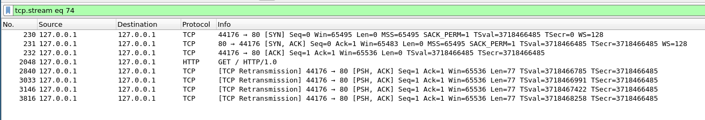

## Linux Networking: How does the Accept Queue work?

tldr: We use Apache Benchmark to send requests to an Apache + PHP-FPM backend while looking at the output of some performance analysis tools. Therefore I captured my terminal with asciinema. On heavy load Linux will queue packets to the Accept Queue. If it's full the kernel will drop packets.


I recently experienced the following:

1. Monitoring said: haproxy backend is down
2. I tried to connect to the backend with `curl -v` and I could verify: I couldn't establish a tcp connection
3. On on the server I checked
    - [X] apache is running
    - [X] port 80 is open
    - [X] iptables ACCEPTs port 80
    - [ ] still no tcp connection

The actual problem was the slow application behind Apache. The Accept Queue of Apache was full so the Linux kernel dropped SYN packets. Cloudflare published a fantastic blog post where they describe the insights of the Accept Queue (https://blog.cloudflare.com/syn-packet-handling-in-the-wild/. You should definitely read it before continuing.


I created a [tmux script](tmux.sh) which starts a bunch of performance analysis tools. Then with `ab` (Apache Benchmark) we can send arbitrary concurrent requests to the backend. We can play with a different load and see how Linux behaves. I used [asciinema](https://asciinema.org/docs/getting-started) to record my terminal sessions.

### Explanation of the setup
- vagrant VM with Ubuntu 18.04 and 1GB RAM
- Apache + PHP-FPM like described [here](https://tecadmin.net/install-apache-php-fpm-ubuntu-18-04/) (but with php7.2)
    - no optimizations (I used the default settings)
- ab (Apache Benchmark) to send concurrent requests
    - Debian/Ubuntu: `sudo apt-get install apache2-utils`
    - Arch: `yay apache-tools`
- some performance analysis tools (I recommend this fantastic [read](https://netflixtechblog.com/linux-performance-analysis-in-60-000-milliseconds-accc10403c55))
- a bash script with some tmux commands

This is our application:

```php
<?php
echo "PHP is now handling this request\n";
echo str_repeat('.', 4096) . "\n";;
flush();

sleep(3);

echo "PHP is done with this request\n";
?>
```
We want to differ between 'a tcp connection was established' and 'the application started handling our request'. Therefore I just print some output before doing some work (sleep 3). 


### Explanation of the tmux panes


- tmux pane 0: `/usr/sbin/tcpretrans-bpfcc`
    - shows retransmitted packets
    - is part of the bcc tools: https://github.com/iovisor/bcc
    - installation: `sudo apt-get install bpfcc-tools linux-headers-$(uname -r)`
    - docs: https://github.com/iovisor/bcc/blob/master/tools/tcpretrans_example.txt
- tmux pane 1: `watch -n 0.1 ss -tln src :80`
    - shows the backlog parameter
    - shows the the length of the Accept Queue
- tmux pane 2: `watch -n 1 'curl -s localhost/server-status?auto | grep BusyWorkers -A99'`
    - shows the workload of Apache
    - docs: https://httpd.apache.org/docs/2.4/mod/mod_status.html
- tmux pane 3: `/usr/sbin/tcpconnlat-bpfcc`
    - shows the latency of tcp connections (also part of the bcc tools)
    - docs: https://github.com/iovisor/bcc/blob/master/tools/tcpconnlat_example.txt
- tmux pane 4: `sar -n TCP,ETCP 1`
    - prints every second network statistics. We are interested in:

```
      active/s
             The number of times TCP connections have made a direct transition to the SYN-SENT state from the CLOSED state per second [tcpActiveOpens].

      passive/s
             The number of times TCP connections have made a direct transition to the SYN-RCVD state from the LISTEN state per second [tcpPassiveOpens].

      retrans/s
             The  total number of segments retransmitted per second - that is, the number of TCP segments transmitted containing one or more previously transmitted octets [tcpRe‐
             transSegs].
```

- tmux pane 5: `watch -n 0.1 'ss -tan state established dst :80 | wc -l'`
    - shows the amount of established tcp connetions for port 80
- tmux pane 6: `watch -n 0.1 'ss -tn state syn-sent | wc -l'`
    - shows the amount of tcp connections in state syn-sent
    - syn-sent means: I sent you a SYN but have not received a SYN-ACK so far
- tmux pane 7: `watch -n 0.3 'nstat -az TcpExtListenDrops'`
    - system wide counter which shows how many packets are dropped by the kernel


### Round #1: idle
[](https://asciinema.org/a/325486)
**Observation**

- in tmux pane 2 we use curl to get the state of the Apache workers every second

```
Scoreboard Key:
"_" Waiting for Connection, "S" Starting up, "R" Reading Request,
"W" Sending Reply, "K" Keepalive (read), "D" DNS Lookup,
"C" Closing connection, "L" Logging, "G" Gracefully finishing,
"I" Idle cleanup of worker, "." Open slot with no current process
```

- `sar` shows us 1 active/s and 1 passive/s, no retransmits (basically just the curl requests)
- `ss -tln src :80` shows us the 
    - backlog parameter (Recv-Q: 128) Apache uses
    - the current length of the Accept Queue (Send-Q: 0)
- Apache uses [511 as default backlog parameter](https://httpd.apache.org/docs/current/en/mod/mpm_common.html#listenbacklog) but the value is limited by /proc/sys/net/core/somaxconn
- [man 2 listen](http://man7.org/linux/man-pages/man2/listen.2.html) says: "Since Linux 5.4, the default in this file is 4096; in earlier kernels, the default value is 128."
- the both ss commands in tmux pane 5 and 6 are lying
    - the `1` is is just the header `ss` prints
    - in pane 5 there should be a `2` (1 header line + 1 line for the established connection made by curl)
        - probably the connection terminated to quickly
- the latency is around 0.05 ms which is pretty low but it's just localhost
- the 44720 connection drops come from my previous experiments :)


### Round #2: sending 50 concurrent requests
[](https://asciinema.org/a/V6iawgVpHYQuCGXD0Ht5fgVf5)
**Observations**

- `ab -n 10000 -c 50` sends 10000 requests in total and 50 requests concurrently
- 51 connections are in state established (1x curl crawling the scoreboard and 50 requests from `ab`)
- 51 Apache workers are busy
- the latency is almost the same as in idle
- the Accept Queue is still empty because Apache+PHP-FPM is fast enough to cope with the 50 requests
- `sar` statistics:
    - after `ab` was started there were 50 outgoing requests in one second (+ 1 curl request)
    - after Apache+PHP-FPM processed some requests `ab` sent new packets to stock up to 50 concurrent connections
- the manually executed `curl -v 127.0.0.1/robots.txt` just worked immediately


### Round #3: sending 200 concurrent requests
[](https://asciinema.org/a/325488)
**Obersvations**

- things are getting excited! We are sending 200 concurrent requests with `ab`
- `sar -tn state established` shows 201 established tcp connections 
- the Apache scoreboard hangs because Apache is not fast enough to respond in one second
    - after some time we got lucky and get some information out of the scoreboard:
        - Apache has around 150 busy workers
        - there are around 50 requests which cannot be handled by the application
        - that's why we see around 50 requests in the Accept Queue pending
- Let's look at my manually executed `curl -v 127.0.0.1/robots.txt` request
    - `/robots.txt` is a static file. So PHP-FPM cannot be the bottleneck
    - the tcp connection is established immediately
    - then `curl` sends the actual HTTP request
    - as Apache+PHP-FPM are currently busy (`IdleWorkers: 0`) the request will be queued to the Accept Queue
    - after some time the request gets served by Apache
- latency is still low
- we don't have any drops or retransmissions

### Round #4: sending 1000 concurrent requests
[](https://asciinema.org/a/325489)
**Obervations**

- prepare for kernel drops! We are sending 1000 concurrent requests with `ab`
- as previously: the requests to the Apache scoreboard took too long: we basically see two states:
    - before calling `ab`: the IdleWorkers increased to 224 (I gave Apache some load before)
    - after calling `ab`: 255 BusyWorkers and no IdleWorkers
- there are around 480 established connections
- the Accept Queue of Apache is full (129). This means:
    - the kernel does not respond to SYN requests (by dropping the SYN packets)
    - `nstat -az TcpExtListenDrops` increases as more packets are dropped
    - there are around 520 packets in SYN-SENT state (`ab` wants to sent 1000 requests. 480 of them are in state established)
- as `ab` does not get SYN-ACKs back it will retransmit the SYNs after some time. You can see this in the capture:
    - check the retrans/s value of `sar` in the right top corner
    - in the left top corner retransmitted packets are shown
- Let's check the manually executed `curl -v 127.0.0.1/robots.txt`
    1. `curl` sends a SYN
    2. the kernel drops the SYN 
    3. after some time `curl` retransmits the SYN (you can see it in the top left corner; probably pid 20593)
    4. after some time if `Accept Queue length < backlog parameter`: 
        - the server/kernel responds with SYN-ACK
        - in the capture the Accept Queue is 127 for a very short amount of time just before the tcp connection of the `curl` gets established
    5. `curl` now has an established connection and sends the http request
    6. at this time the request is still queued in the Accept Queue
    7. after some time: Apache handles the request
- if you check the latency there are two cases:
    - around 0.5 ms: client instantly gets the SYN-ACK back
    - if the SYN packets were dropped: 
        - it takes some time until the SYN-ACK is received 
        - you can see a pattern: the latency is 1, 3, 7 or 15 seconds + some ms (exponential backoff algorithm)

### One last detail: retransmitted packets in the state established 
`/usr/sbin/tcpretrans-bpfcc` (tmux pane 0 of the run with the 1000 requests) showed us that there were retransmitted packets in the state established. How can that happen?  

This is what it looks like in Wireshark:




I'm not quite sure about this. Please correct me if I'm wrong:  

1. client sends a SYN and is in state SYN-SENT
2. server receives the SYN:
    - assumption: `Accept Queue < backlog parameter` => the SYN is not dropped by the kernel
    - server responds with SYN-ACK and goes into state SYN-RECEIVED
        - (in general: server goes into ESTABLISHED if the client ACKs the SYN-ACK packet)
3. client receives the SYN-ACK and goes into state ESTABLISHED
4. client sends a packet which contains
    - the ACK for the SYN-ACK of the server
    - the actual HTTP request
5. on the server side:
    - assumption: in the meantime the Acccept Queue is full
    - the kernel drops the packet
6. the client will retransmit the packet
7. capture ends (not the tcp connection :blush:)

This behavior is also explained [here](https://veithen.io/2014/01/01/how-tcp-backlog-works-in-linux.html) (grep "To summarize, if the TCP in Linux" -A9999). 

### Conclusive remarks
There is [tcpdrop](https://github.com/iovisor/bcc/blob/master/tools/tcpdrop_example.txt) as part of the bcc tool collection which shows dropped packages by the kernel. But it's not part of the Ubuntu 18.04 package. I wonder why the kernel does not log dropped messages. Would be cool to see this in `demsg`. Also it would be nice to have a tool that shows established long running tcp connections as they can use/hold/block Apache/PHP-FPM worker for a long time.

### Appendix

You can play the asciima recordings offline: `asciinema play asciima-recordings/0_idle.rec` (use a 1080p monitor)   
Some shortcuts:  
- you can change the speed, try `asciinema play -h`   
- `space` for pause  
- `.` for show next frame  

